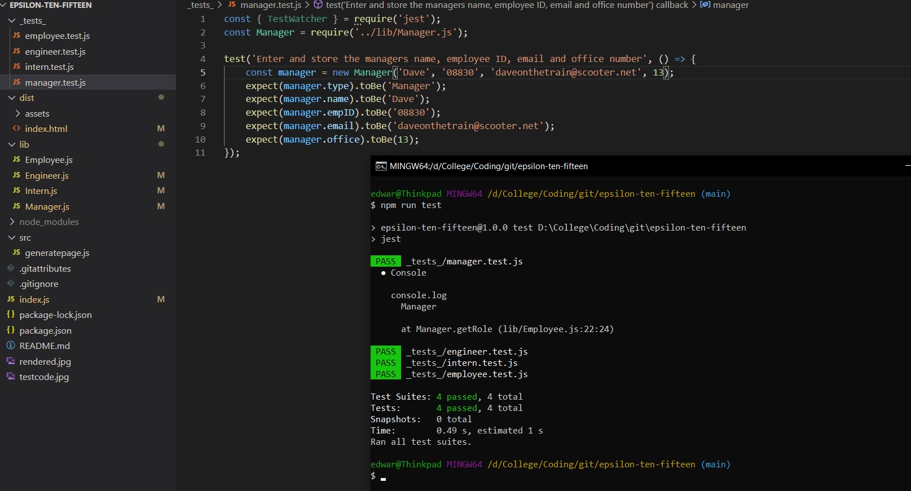
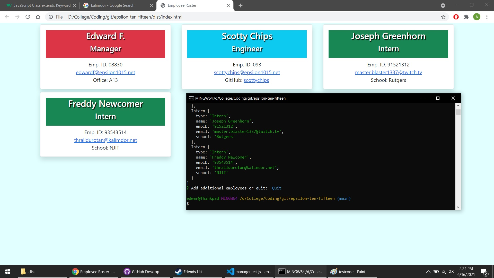

# Team Profile Generator by Edward Frary

## Description:
This application was created using node and jest for the purpose of employee team profile generation. The user runs **node index.js** through their console and is met with a series of prompts that will gather the relevent information from the user in order to automatically populate a HTML file with the details of their team of employees.

## Images: 

 

## Questions:
Direct email: (edwardfrary@gmail.com)
GitHub: (https://github.com/edwardfrary)
 
